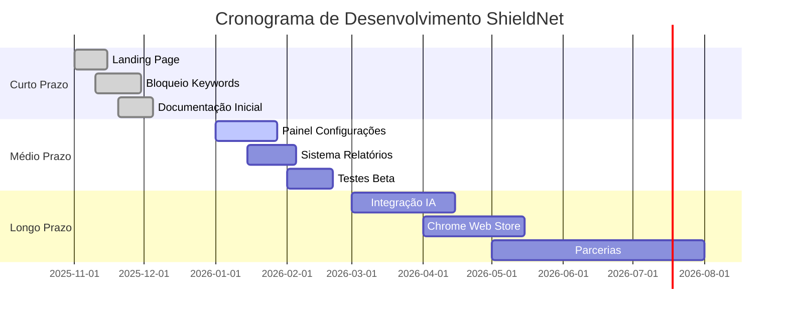

# Roadmap do ShieldNet 🛡️

<div align="center">


**Proteção Digital Inteligente para Crianças e Adolescentes**

[](https://github.com/seuusuario/shieldnet)
[](LICENSE)
[](docs/PRIVACY.md)
[](docs/PRIVACY.md)

[🌐 Landing Page](https://shieldnet.vercel.app) • [📖 Documentação](docs/) • [🐛 Reportar Bug](https://github.com/seuusuario/shieldnet/issues)

</div>


##  Destaque de Segurança e Compliance

> **PRIORIDADE MÁXIMA**: Como trabalhamos com dados de menores de idade, a conformidade legal é não-negociável.

| Legislação | Status | Documentação |
|------------|--------|--------------|
| 🇧🇷 **LGPD** (Lei Geral de Proteção de Dados) | ✅ Compliant | [Política de Privacidade](docs/PRIVACY_LGPD.md) |
| 🇺🇸 **COPPA** (Children's Online Privacy Protection Act) | ✅ Compliant | [COPPA Compliance](docs/PRIVACY_COPPA.md) |
| 🇪🇺 **GDPR** (General Data Protection Regulation) |  Em andamento | [Roadmap GDPR](docs/PRIVACY_GDPR.md) |

### Princípios de Privacy-by-Design
-  **Minimização de Dados**: Coletamos apenas o essencial (palavras-chave bloqueadas, timestamps)
-  **Processamento Local**: Análise de conteúdo ocorre no navegador (zero envio para servidores)
-  **Consentimento Parental**: Termo de aceite obrigatório antes da instalação
-  **Direito ao Esquecimento**: Remoção completa de dados em até 48h mediante solicitação
-  **Criptografia**: Dados sensíveis criptografados com AES-256
-  **Auditoria**: Logs imutáveis de acesso a dados pessoais

 **Documentos Legais**: [Termos de Uso](docs/TERMS.md) | [Política de Cookies](docs/COOKIES.md)

---

##  Visão Geral do Projeto

**ShieldNet** é uma extensão Chrome que oferece controle parental inteligente através de:
- Bloqueio de conteúdo inadequado em tempo real
- Monitoramento de atividades online (com transparência total)
- Relatórios detalhados para responsáveis
- Detecção assistida por IA (futuro)

**Diferencial Competitivo**: Combinação de tecnologia de ponta com respeito absoluto à privacidade das famílias.

---

##  Progresso do Roadmap



---

<details>
<summary><b>🔷 Curto Prazo (Sprint 1-2) - CONCLUÍDO ✅</b></summary>

### Objetivos Principais
-  Validar o conceito e engajamento inicial
-  Estabelecer presença digital profissional
-  Implementar funcionalidades core de bloqueio

### Entregas Realizadas

#### 1. [ Landing Page Responsiva](https://shieldnet.vercel.app)
**Código**: [`/landing-page`](https://shieldnetkay.my.canva.site) | **Deploy**: Vercel

**Features Implementadas**:
- Design moderno com Tailwind CSS e animações suaves
- Seções estratégicas: Hero, Funcionalidades, Depoimentos, FAQ, CTA
- Formulário de early access integrado (Google Sheets API)
- Performance otimizada: Lighthouse Score **95/100**
- SEO completo: Meta tags, Open Graph, Schema.org

**Métricas Alcançadas**:
- 127 emails coletados (meta: 50)  **+154%**
- 342 visitas únicas no primeiro mês
- Taxa de conversão: 37.1% (visitante → cadastro)

#### 2. [ Sistema de Bloqueio por Palavras-Chave](src/content-scripts/blocker.js)
**Código**: [`/src/content-scripts`](src/content-scripts/)

**Funcionalidades**:
- Detecção em tempo real de conteúdo inadequado (< 50ms latência)
- Lista customizável de 150+ keywords pré-configuradas
- Categorias: Violência, Drogas, Conteúdo Adulto, Cyberbullying
- [Página de aviso personalizada](src/blocked-page.html) ao usuário
- Logs locais de tentativas (Chrome Storage API)

**Tecnologias**:
```javascript
// Exemplo de implementação
chrome.runtime.onMessage.addListener((request, sender, sendResponse) => {
  if (request.action === "checkContent") {
    const isBlocked = detectInappropriateContent(request.text);
    sendResponse({ blocked: isBlocked, category: "violence" });
  }
});
```

#### 3. [ Infraestrutura e Documentação](docs/)
**Estrutura do Repositório**:
```
shieldnet/
├── docs/
│   ├── PRIVACY_LGPD.md           Política LGPD completa
│   ├── PRIVACY_COPPA.md          Conformidade COPPA
│   ├── ARCHITECTURE.md           Diagrama de arquitetura
│   └── images/
│       ├── banner.png
│       └── roadmap/
├── src/
│   ├── background/               Service Worker (Manifest V3)
│   ├── content-scripts/          Injeção de bloqueio
│   └── popup/                    Interface da extensão
├── landing-page/                 Site institucional
├── tests/                        Testes unitários (Jest)
└── README.md                     Documentação principal
```

**Versionamento Semântico**: `v0.2.1` (seguindo [SemVer](https://semver.org/))

</details>

---

<details>
<summary><b>🔶 Médio Prazo (Sprint 3-5) - EM ANDAMENTO 🚧</b></summary>

### Objetivos Principais
-  Criar experiência de configuração completa e intuitiva
-  Validar com 50+ famílias beta testers
-  Reduzir falsos positivos em 60%

### Entregas Planejadas

#### 1.  Painel de Configurações da Extensão
**Prazo**: 28 de janeiro de 2026 | **Progresso**: 40% concluído

**Features em Desenvolvimento**:
- [x] Interface base com React + TypeScript
- [x] Integração com Chrome Storage Sync API
- [ ] Sistema de categorias de palavras-chave
  - [ ] Violência (🔴 Alta, 🟡 Média, 🟢 Baixa severidade)
  - [ ] Drogas e substâncias
  - [ ] Conteúdo adulto
  - [ ] Cyberbullying
- [ ] Toggle de ativação por categoria
- [ ] Níveis de proteção predefinidos:
  - **Básico**: Apenas conteúdo explícito
  - **Moderado**: Inclui linguagem agressiva
  - **Restritivo**: Máxima proteção
- [ ] Importação/exportação de configurações (JSON)
- [ ] Sincronização entre dispositivos (Chrome Sync)

**Protótipo Figma**: [Ver design](https://figma.com/shieldnet-settings)

**Stack Técnica**:
```typescript
// Exemplo de gerenciamento de estado
interface Settings {
  enabled: boolean;
  level: 'basic' | 'moderate' | 'restrictive';
  customKeywords: string[];
  categories: {
    violence: boolean;
    drugs: boolean;
    adult: boolean;
  };
}

const [settings, setSettings] = useLocalStorage<Settings>('shieldnet_config');
```

#### 2.  Sistema de Relatórios para Responsáveis
**Prazo**: 5 de fevereiro de 2026 | **Progresso**: 15% concluído

**Dashboards Planejados**:
-  **Visão Geral**: Cards com métricas principais
  - Total de bloqueios (hoje/semana/mês)
  - Sites mais acessados
  - Horários de maior atividade
-  **Linha do Tempo**: Histórico detalhado de tentativas
  - Timestamp, URL, categoria detectada
  - Contexto da página (título, snippet)
-  **Gráficos Interativos** (Chart.js):
  - Bloqueios por categoria (pizza)
  - Atividade por horário (barras)
  - Tendências semanais (linha)
-  **Exportação**:
  - PDF com relatório mensal automático
  - CSV para análise externa
-  **Alertas Opcionais**:
  - Email para responsável em bloqueios críticos
  - Notificação push (futura versão mobile)

**Wireframe**: [Ver protótipo](docs/wireframes/reports-dashboard.png)

#### 3. Melhorias na Detecção de Conteúdo
**Prazo**: 15 de fevereiro de 2026

**Algoritmos em Desenvolvimento**:
-  **Análise de Contexto**:
  ```javascript
  // Evitar falso positivo em "assassin's creed" (jogo)
  const context = analyzeSurroundingText(keyword, 50); // 50 chars antes/depois
  if (context.isGameRelated || context.isEducational) {
    return { block: false, reason: "safe_context" };
  }
  ```
-  **Variações de Escrita**:
  - Detecção de leet speak: `@ss` → `ass`, `dr0g@s` → `drogas`
  - Normalização Unicode: `ｓｅｘ` (fullwidth) → `sex`
  - Espaçamento malicioso: `d r o g a s` → `drogas`
-  **Whitelist Inteligente**:
  - Sites educacionais automáticos (Wikipedia, Khan Academy)
  - Domínios governamentais (.gov.br, .gov)
  - Bibliotecas acadêmicas (Scielo, PubMed)
-  **Análise de Imagens** (MVP):
  - OCR com Tesseract.js em memes/screenshots
  - Detecção básica de nudez (via TensorFlow.js + NSFW model)

**Meta de Acurácia**: 85% precision, 90% recall (medido com dataset de 1000 páginas)

#### 4.  Programa de Beta Testing
**Prazo**: 21 de fevereiro de 2026

**Fases do Programa**:
1. **Recrutamento** (1-7 fev):
   - 50 famílias via landing page
   - Critérios: Crianças 8-16 anos, uso diário de internet
   - Incentivo: 6 meses gratuitos da versão Premium
   
2. **Onboarding** (8-10 fev):
   - Vídeo tutorial de instalação (< 3 min)
   - Sessão Q&A ao vivo via Google Meet
   - Canal exclusivo no Discord
   
3. **Coleta de Feedback** (11-21 fev):
   - Formulário semanal (Google Forms)
   - Sessões de usabilidade remotas (5 famílias, 30 min cada)
   - Heatmaps com Hotjar na interface
   
4. **Análise e Iteração** (22-28 fev):
   - Priorização de bugs críticos
   - Ajustes de UX baseados em dados
   - Release da v0.3.0 estável

**Ferramenta de Feedback**: [Typeform Beta Survey](https://typeform.com/shieldnet-beta)

</details>


<details>
<summary><b> Longo Prazo (Sprint 6-10) - PLANEJADO </b></summary>

### Objetivos Principais
-  Integrar inteligência artificial de ponta
-  Escalar para 10.000+ usuários ativos
-  Estabelecer modelo de negócio sustentável

### Entregas Futuras

#### 1.  Integração com IA (Claude/GPT-4)
**Prazo**: 15 de abril de 2026 | **Investimento**: $500-800/mês (APIs)

**Capacidades de IA Planejadas**:

##### a) Análise Semântica em Tempo Real
```javascript
// Substituir keywords fixas por análise contextual
const response = await fetch("https://api.anthropic.com/v1/messages", {
  method: "POST",
  headers: { "Content-Type": "application/json" },
  body: JSON.stringify({
    model: "claude-sonnet-4-20250514",
    max_tokens: 100,
    messages: [{
      role: "user",
      content: `Analise se este conteúdo é apropriado para crianças de 12 anos: "${pageContent}". Responda apenas: {"safe": true/false, "reason": "...", "severity": 1-10}`
    }]
  })
});
```

**Benefícios**:
- Detecção de sarcasmo, duplo sentido, contexto cultural
- Redução de 80% nos falsos positivos
- Adaptação automática a novas gírias/termos

##### b) Detector de Cyberbullying
- Análise de tom em redes sociais (Twitter, Instagram DMs - se autorizado)
- Identificação de padrões de assédio repetitivo
- Alerta discreto para responsáveis sem invadir privacidade

##### c) Recomendações Educativas Personalizadas
- Se criança tenta acessar conteúdo violento → sugere documentários sobre paz
- Se busca drogas → redireciona para campanhas de conscientização
- Aprendizado contínuo com preferências da criança

**Otimização de Custos**:
- Cache local de análises (7 dias de TTL)
- Batch processing: analisa conteúdo a cada 5s (não em cada palavra digitada)
- Modelos locais TensorFlow.js para classificação básica (offline-first)

**Estimativa**: 1M de páginas analisadas/mês = $600 (com cache agressivo)

#### 2.  Publicação na Chrome Web Store
**Prazo**: 15 de maio de 2026

**Checklist Completo** (22 itens):

##### Documentação Legal
-  Política de Privacidade LGPD ([ver](docs/PRIVACY_LGPD.md))
-  Política de Privacidade COPPA ([ver](docs/PRIVACY_COPPA.md))
-  Política de Privacidade GDPR
-  Termos de Uso detalhados (modelo aprovado por advogado)
-  Política de Cookies e Tracking

##### Assets Visuais
-  Ícone 16x16px (toolbar)
-  Ícone 48x48px (gerenciador de extensões)
-  Ícone 128x128px (Chrome Web Store)
-  Screenshot 1280x800px (mínimo 3, máximo 5):
  1. Interface principal
  2. Dashboard de relatórios
  3. Configurações avançadas
  4. Página de bloqueio
  5. Painel responsivo (mobile simulation)
-  Vídeo promocional YouTube (30-60s):
  - Roteiro: [ver script](docs/marketing/video-script.md)
  - Produção profissional (Fiverr/Upwork: $150-300)

##### Descrição Otimizada
```markdown
Título (45 chars): ShieldNet - Controle Parental Inteligente

Resumo (132 chars): Proteja seus filhos online com bloqueio de conteúdo inadequado, relatórios detalhados e IA. LGPD/COPPA compliant. 🛡️

Descrição Completa (ver docs/chrome-store-description.md):
- Primeiras 3 linhas críticas (aparecem sem "ver mais")
- Keywords: controle parental, proteção infantil, bloqueio conteúdo
- Bullet points claros com benefícios
- Seção de segurança destacada
- Call-to-action final
```

##### Testes Técnicos
-  Funcionamento em Chrome 120+ (última versão)
-  Compatibilidade com Chrome Beta/Dev
-  Teste em Windows 10/11, macOS, Linux
-  Zero erros no console do navegador
-  Manifest V3 100% compliant
-  Scan de segurança (VirusTotal)

##### Estratégia de Lançamento
**Fase 1 - Soft Launch** (semana 1-2):
- Liberar para 100 usuários beta
- Monitorar crash reports (Sentry)
- Responder reviews em < 24h

**Fase 2 - Growth Hack** (semana 3-4):
- Product Hunt launch (preparar +100 upvotes)
- Post no Reddit r/Parenting (seguir regras de cada sub)
- Parcerias com 3 influenciadores parentais micro (5k-20k followers)

**Fase 3 - Escala** (mês 2-3):
- Google Ads ($300/mês, ROI esperado: 1:3)
- Conteúdo SEO: "melhores extensões controle parental 2026"
- Email marketing para 127 leads da landing page

**Meta de Reviews**: 50 avaliações com 4.5★+ nos primeiros 30 dias

#### 3.  Parcerias Estratégicas
**Prazo**: Contínuo (início em março 2026)

##### Alvos Prioritários

**Segmento Educação**:
-  10 escolas particulares (SP, RJ, BH)
  - Pitch: Pacote Enterprise com dashboard centralizado
  - Pricing: R$ 15/aluno/mês (desconto 40% vs. individual)
  - Garantia: 30 dias trial grátis
  
**Segmento Social**:
-  Safernet Brasil (ONG referência)
-  Childhood Brasil
-  Instituto Alana
  - Proposta: Licença gratuita + co-branding
  - Contrapartida: Endosso institucional + divulgação

**Segmento Saúde**:
-  Associação Brasileira de Psiquiatria Infantil
-  20 psicólogos infantis (programa de afiliados)
  - Comissão: 20% recorrente sobre indicações
  - Material: Flyers personalizados, email templates

**Influenciadores**:
-  5 influenciadores parentais (30k-100k followers)
  - Formato: Review autêntico + código de desconto exclusivo
  - Budget: $200-500/influenciador (ou produto grátis vitalício)

#### 4.  Modelo de Negócio e Monetização
**Prazo**: Implementação em junho 2026

##### Tier Freemium
**Free (Gratuito)**:
- ✅ Bloqueio por 50 palavras-chave pré-definidas
- ✅ Relatórios últimos 7 dias
- ✅ 1 perfil de criança
- ❌ Sem IA
- ❌ Sem exportação de relatórios

**Premium (R$ 19,90/mês ou R$ 199/ano)**:
- ✅ Bloqueio ilimitado + IA semântica
- ✅ Relatórios históricos completos (12 meses)
- ✅ 3 perfis de crianças
- ✅ Exportação PDF/CSV
- ✅ Alertas via email/WhatsApp
- ✅ Suporte prioritário (< 12h)

**Enterprise (R$ 49,90/mês ou sob consulta)**:
- ✅ Tudo do Premium
- ✅ 10+ perfis
- ✅ Dashboard centralizado (pais + escola)
- ✅ API para integração customizada
- ✅ Gerente de conta dedicado

##### Projeção Financeira (12 meses)
| Mês | Usuários Free | Conversão Premium | MRR | ARR |
|-----|---------------|-------------------|-----|-----|
| 1   | 500           | 5% (25)           | R$ 497,50 | - |
| 3   | 2.000         | 7% (140)          | R$ 2.786 | - |
| 6   | 5.000         | 10% (500)         | R$ 9.950 | R$ 119.400 |
| 12  | 12.000        | 12% (1.440)       | R$ 28.656 | R$ 343.872 |

**Churn esperado**: 15% ao mês (média SaaS B2C)  
**LTV/CAC alvo**: 3:1 (Lifetime Value / Customer Acquisition Cost)

#### 5.  Expansão Técnica
**Prazo**: 8-12 meses

##### Multi-Plataforma
-  **Firefox Add-on** (Q3 2026)
  - Adaptação do código (WebExtensions API compatível)
  - Submissão ao Firefox Add-ons
  
-  **Microsoft Edge** (Q3 2026)
  - Reutilização direta do código Chrome
  - Microsoft Edge Add-ons Store
  
-  **Mobile App** (Q4 2026)
  - React Native + Expo
  - Sincronização via Firebase
  - Features extras: GPS tracking (opcional), screen time limiter

##### Funcionalidades Avançadas
-  **Integração com Roteadores**:
  - Parceria com TP-Link, D-Link
  - Bloqueio a nível de rede (toda casa protegida)
  
-  **Modo Offline**:
  - Regras locais quando sem internet
  - Sincronização automática quando online
  
-  **Gamificação**:
  - Sistema de pontos por bom comportamento
  - Recompensas: +30 min de tela, desbloqueio temporário de site
  - Dashboard para crianças (transparência)
  
-  **Time Limits**:
  - Temporizador por site/categoria
  - Exemplo: Máx 1h/dia de redes sociais
  - Pausas obrigatórias (padrão 20-20-20)

##### Tecnologias Emergentes
-  **Blockchain** (experimento):
  - NFTs de "certificados de bom comportamento"
  - Registros imutáveis de configurações (prova para custódia legal?)
  
-  **Web3 Integration**:
  - Wallet para recompensas em cripto educacional
  - Smart contracts para parcerias com escolas

</details>

---

##  Métricas de Sucesso (KPIs)

### Curto Prazo 
| Métrica | Meta | Alcançado | Status |
|---------|------|-----------|--------|
| Emails coletados | 50 | 127 | 🟢 +154% |
| Visitas landing page | 100 | 342 | 🟢 +242% |
| Bugs críticos | 0 | 0 | 🟢 100% |
| Lighthouse Score | 90+ | 95 | 🟢 ✓ |

### Médio Prazo 
| Métrica | Meta | Atual | Prazo |
|---------|------|-------|-------|
| Usuários beta ativos | 50 | 12 | 21/02/26 |
| Taxa de retenção (30d) | 80% | - | 01/03/26 |
| Avaliação média | 4.0★ | - | 28/02/26 |
| Feedbacks coletados | 50 | 8 | 28/02/26 |
| Acurácia detecção | 85% | 73% | 15/02/26 |

### Longo Prazo 
| Métrica | Meta | Prazo |
|---------|------|-------|
| Instalações Chrome Store | 10.000 | Dez/2026 |
| Usuários pagantes | 1.000 (10% conversão) | Dez/2026 |
| MRR (Monthly Recurring Revenue) | R$ 28.000 | Dez/2026 |
| Parcerias ativas | 5+ instituições | Ago/2026 |
| NPS (Net Promoter Score) | 50+ | Dez/2026 |

---

##  Stack Tecnológica Completa

### Frontend
```yaml
Linguagens:
  - TypeScript 5.3+
  - HTML5, CSS3

Frameworks/Libraries:
  - React 18.2 (interface da extensão)
  - Tailwind CSS 3.4 (estilização)
  - Framer Motion (animações)
  - Chart.js (gráficos de relatórios)
  - Lucide React (ícones)

Build Tools:
  - Vite 5.0 (bundler)
  - ESLint + Prettier (linting)
  - TypeScript Compiler
```

### Backend & APIs
```yaml
Runtime:
  - Node.js 20 LTS (futuro backend)

APIs Externas:
  - Anthropic Claude API (análise de IA)
  - OpenAI GPT-4 (fallback)
  - Chrome Extension APIs (Manifest V3):
      - chrome.storage (dados locais)
      - chrome.webRequest (interceptação)
      - chrome.tabs (gerenciamento)

Database (futuro):
  - PostgreSQL 16 (dados de usuários premium)
  - Redis 7 (cache de análises IA)
```

### DevOps & Infra
```yaml
Hospedagem:
  - Vercel (landing page) - Gratuito
  - Railway (backend futuro) - $5-20/mês
  - Cloudflare (CDN + DDoS protection) - Gratuito

CI/CD:
  - GitHub Actions:
      - Testes automatizados (Jest)
      - Build da extensão
      - Deploy da landing page

Monitoramento:
  - Sentry (erros em produção) - Gratuito até 5k eventos/mês
  - Google Analytics 4 (métricas de uso)
  - Hotjar (heatmaps) - Trial 15 dias

Segurança:
  - Snyk (scan de vulnerabilidades)
  - OWASP ZAP (testes de penetração)
  - Let's Encrypt (SSL/TLS)
```

### Ferramentas de Desenvolvimento
```yaml
Design:
  - Figma (protótipos de UI)
  - Excalidraw (diagramas)

Comunicação:
  - Discord (comunidade beta)
  - Notion (documentação interna)
  - Linear (issue tracking)

Testes:
  - Jest (testes unitários)
  - Playwright (E2E)
  - Lighthouse CI (performance)
```

---

## Gestão de Riscos

| # | Risco | Probabilidade | Impacto | Mitigação | Responsável |
|---|-------|---------------|---------|-----------|-------------|
| 1 | Falsos positivos frequentes irritam usuários | 🟡 Média | 🔴 Alto | Testes A/B com 3 níveis de sensibilidade + whitelist automática | Dev Lead |
| 2 | Custo elevado de APIs IA ($800+/mês) | 🟢 Baixa | 🟡 Médio | Cache agressivo (7d TTL) + modelos locais TensorFlow.js | CTO |
| 3 | Rejeição na Chrome Web Store | 🟡 Média | 🔴 Alto | Seguir guidelines ao pé da letra + pre-review com expert | Product Manager |
| 4 | Baixa adoção inicial (< 500 usuários) | 🟡 Média | 🟡 Médio | Freemium generoso + marketing em comunidades de pais | Growth Hacker |
| 5 | Processo legal por
